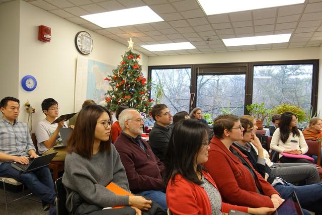
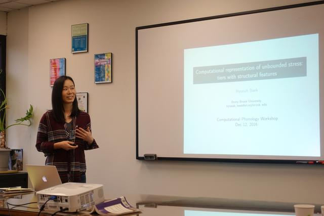
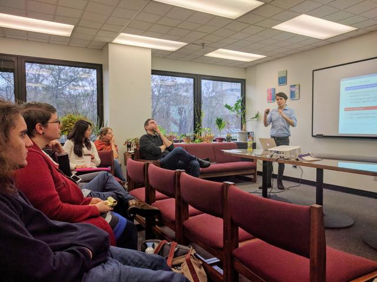
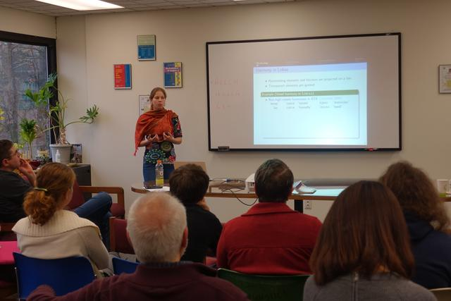
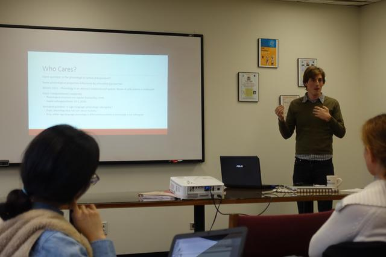

# Introduction

The purpose of this workshop is to allow students in Fall 2016's [Computational Phonology seminar](https://github.com/StonyBrook-Lin626-F16/main) at [Stony Brook University](http://linguistics.stonybrook.edu) to present their research findings to a wider audience.
The unifying theme of all student presentations is the application of subregular computational models to phonology.
The program covers a wide range of phenomena, including harmony processes, word stress, and metathesis.
Some presentations also explore formal aspects of the computational models or extend them to other language domains, in particular syntax.

# Date & Venue

**Date**: Monday, December 12, 2016  
**Time**: 10:30am to 6:00pm  
**Location**: Linguistics Department, Seminar Room (SBS S-207)

# Invited Speaker

The workshop concludes with a *Frontiers* talk by [Adam Jardine](http://rci.rutgers.edu/~aj591/) ([Rutgers University](http://ling.rutgers.edu/)).
As is common for *Frontiers* talks, we will have dinner with the speaker afterwards at the Hilton Garden Inn.
Please send an email to [workshop@thomasgraf.net](mailto:workshop@thomasgraf.net) if you are interested in attending the dinner.

# Program

| Time | Talk |
| --:  | :-- |
| 10:30 - 10:50 | Thomas Graf, [Introduction and tutorial session][graf_slides] |
| 10:50 - 11:00 | Mini break |
| **11:00 - 12:30** | **Tier-Based Strictly Local Phonology** (Chair: Jeffrey Heinz) |
| 11:00 - 11:30 | Hyunah Baek, [Computational representation of unbounded stress patterns: tiers with structural features][baek_abstract] [(Slides)][baek_slides] |
| 11:30 - 12:00 | Aniello De Santo, [A game of tiers: Exploring the formal properties of TSL languages][desanto_abstract] [(Slides)][desanto_slides] |
| 12:00 - 12:30 | Alëna Aksënova, [To achieve harmony we only need one tier][aksenova_abstract] [(Slides)][aksenova_slides] |
| 12:30 - 2:10 | Lunch break |
| **2:10 - 3:00** | **Subregular Mappings in Phonology**  (Chair: Adam Jardine) |
| 2:10 - 2:40 | Chikako Takahashi, [Multiple metathesis is strictly local: evidence from stress driven metathesis][takahashi_abstract] [(Slides)][takahashi_slides] |
| 2:40 - 3:00 | *Blitz talks - Session 1*; Logan Peng [(Slides)][peng_slides], Jon Rawski [(Slides)][rawski_slides] |
| 3:00 - 3:10 | Mini break|
| **3:10 - 4:00** | **Syntax and Morphology** (Chair: Thomas Graf) |
| 3:10 - 3:40 | Hongchen Wu, [Tier-based strictly local analyses of negation in Mandarin Chinese][wu_abstract] [(Slides)][wu_slides] |
| 3:40 - 4:00 | *Blitz talks - Session 2*; Lei Liu [(Slides)][liu_slides], Jimmy Suzuki [(Slides)][suzuki_slides] |
| 4:00 - 4:30 | Coffee break |
| 4:30 - 6:00 | Adam Jardine, [Expressivity and autosegmental structure][jardine_abstract] |

# Registration

No registration is required for the workshop itself.
For the Frontiers talk dinner, write to [workshop@thomasgraf.net](mailto:workshop@thomasgraf.net).

# Workshop Pictures

  
*Our seminar room, pretty packed*

  
*Hyunah kicks off the student talks*

  
*Looks like Aniello's talk really got Jeff thinking*

  
*Two slides into Alëna's talk we already encounter the first exotic language*

  
*Jon always asks the toughest questions: Who cares?* 

Thanks to Sophie Moradi for taking pictures throughout the day!

[graf_slides]: https://github.com/CompLab-StonyBrook/compphon_workshop/blob/master/slides/graf/tutorial_slides.pdf?raw=true
[baek_slides]: https://github.com/CompLab-StonyBrook/compphon_workshop/blob/master/slides/baek/baek.pdf?raw=true
[desanto_slides]: https://github.com/CompLab-StonyBrook/compphon_workshop/blob/master/slides/desanto/desanto.pdf?raw=true
[aksenova_slides]: https://github.com/CompLab-StonyBrook/compphon_workshop/blob/master/slides/aksenova/aksenova.pdf?raw=true
[takahashi_slides]: https://github.com/CompLab-StonyBrook/compphon_workshop/blob/master/slides/takahashi/takashi.pdf?raw=true
[peng_slides]: https://github.com/CompLab-StonyBrook/compphon_workshop/blob/master/slides/peng/peng.pdf?raw=true
[rawski_slides]: https://github.com/CompLab-StonyBrook/compphon_workshop/blob/master/slides/rawski/rawski.pdf?raw=true
[wu_slides]: https://github.com/CompLab-StonyBrook/compphon_workshop/blob/master/slides/wu/wu.pdf?raw=true
[liu_slides]: https://github.com/CompLab-StonyBrook/compphon_workshop/blob/master/slides/liu/liu.pdf?raw=true
[suzuki_slides]: https://github.com/CompLab-StonyBrook/compphon_workshop/blob/master/slides/suzuki/suzuki.pdf?raw=true
[baek_abstract]: https://github.com/CompLab-StonyBrook/compphon_workshop/blob/master/abstracts/baek.pdf?raw=true
[desanto_abstract]: https://github.com/CompLab-StonyBrook/compphon_workshop/blob/master/abstracts/desanto.pdf?raw=true
[aksenova_abstract]: https://github.com/CompLab-StonyBrook/compphon_workshop/blob/master/abstracts/aksenova.pdf?raw=true
[takahashi_abstract]: https://github.com/CompLab-StonyBrook/compphon_workshop/blob/master/abstracts/takahashi.pdf?raw=true
[wu_abstract]: https://github.com/CompLab-StonyBrook/compphon_workshop/blob/master/abstracts/wu.pdf?raw=true
[jardine_abstract]: https://github.com/CompLab-StonyBrook/compphon_workshop/blob/master/abstracts/jardine.pdf?raw=true
